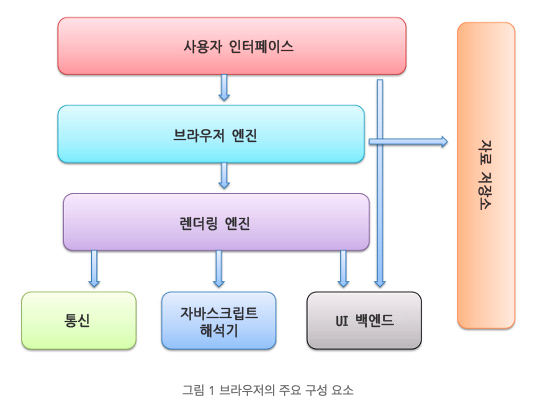

# 브라우저
브라우저 역시 소프트웨어. 
가장 많이 사용하는 소트웨어.

# 주요기능
사용자가 선택한 자원을 서버에 요청하고 브라우저에 표시하는것
자원은 보통 HTML이지만 PDF, 또는 이미지 등 다른 형태일 수 있다.
자원의 주소는 URI에 의해 정해진다.

# 구성요소

1. 사용자 인터페이스 : 주소표시줄, 이전/다음 버튼 등 요청한 페이지를 보여주는 창을 제외한 나머지 모든 부분
2. 브라우저 엔진 - 사용자 인터페이스와 렌더릴 엔진 사이의 동작 제어
3. 렌더링 엔진 - 요청한 콘텐츠를 표시.
4. 통신 - 네트워크 호출에 사용 - 플랫폼 독자적인 인터페이스이고 각 플랫폼 하부에서 실행
5. UI 백엔드 - 콤보 박스와 창 같은 기본적인 장치를 그림. 플랫폼에서 명시하지 않은 일반적인 인터페이스로서 OS 사용자 인터페이스 체계를 사용.
6. 자바스크립트 해석기 - 자바스크립트 코드를 해석하고 실행.
7. 자료 저장소 - 이 부분은 자료를 저장하는 캡슐. 쿠키를 저장하는 것과 같이 모든 종류의 자원을 하드 디스크에 저장할 필요가 있음.
 * 크롬은 대부분의 브라우저와 달리 각 탭마다 별도의 렌더링 엔진 인스턴스를 유지함, 독립적인 프로세스로 처리.

 # 렌더링 엔진
 애플 사파리, 크롬 - 웹킷
 파이어폭스 - 게코

 https://d2.naver.com/helloworld/59361