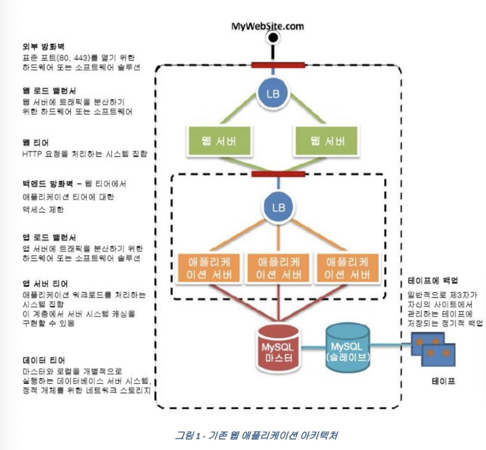
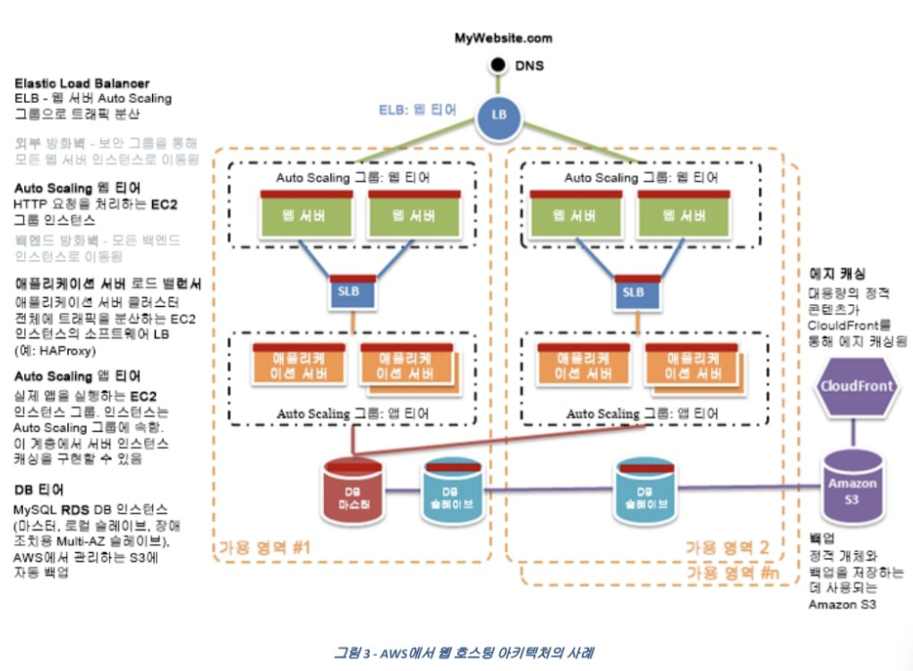

# 영역 1: 복원력을 갖춘 아키텍처 설계

# AWS 인프라 구성
- 전 세계 21개의 지리적 리전 내에 66새의 가용영역을 운용

# Region 의미
- 리전은 개별 지역 내 존재하는 지리적 위치

# AZ (가용역역) 의미
- 가용영역은 리전 내 있는 구분된 가용성 영역 의미
- 전용선으로 연결되어 있어 한 클러스터처럼 동작

# Amazon CloudFront 글로벌 엣지 네트워크
- 유저에게 짧은 지연시간으로 콘텐츠를 전송 할 수 있도록 해줌
    - 특징
        - 여러공격으로부터 네트워크 및 어플리케이션 계층을 보호 AWS Edge역할
        - 가용성 향상을 위해 콘텐츠 캐싱 오리진 서버 부하 줄임
        - 여러 오리진을 설정, 소스오리진 사용불가시 자동으로 백업 오리진 사용하도록 라우팅
        - 프로그래밍 가능한 정식 API 제공

# 클라우드 서비스를 설계하는 방법
- 설계 포인트
  - 보안 : 전송 및 보관시 암호화, IAM으로 권한 관리, VPC로 인프라 보호, CloudWatch로 감시 제어 활동
  - 안정성: 복구 절차 테스트 및 자동 복구 설정, 수평확장이 가능하도록 구성
  - 성능 효율화: AWS에서 최신 기술 쉽게 사용하도록 지원, 글로벌 어플리케이션 지원 및 서버리스 아키텍처를 이용한 새로운 아이디어 실험
  - 비용 최적화: 오토 스케일링을 통한 필요한 자원만 사용, 비용 효율적인 지원 사용

# AWS 기반 마이크로 서비스 아키텍쳐 구현 방안
- 마이크로서비스란?
    - 작은 빌딩 블록, 높은 비결합성, 작은 작업 수행, 머듈식의 접근, 디자인 스타일
    - 고려사항
        - 리소스관리: EC2 컨테이너를 사용해서 유연하고 AWS 응용이 쉬운 상태로 설계, Lamda를 사용하여 Serverless이벤트 처리 방식의 컴퓨팅 서비스 사용
        - 모니터링: AWS CloudWatch
        - 서비스 Discovery: EC2 와 Route53 사용
        - 배포: Blue-green 배포, Lambda 배포 사용

# 느슨한 결합을 구현하기 위한 서비스들
- ELB
    - 로드밸런서 선택 시 : 애플리케이션에 맞는 로드 밸런서 선택
    - Application load Balancer, Network load Balancer, Classic load balancer 를 적절히 사용
    - Application load balancer : HTTP, HTTPS, Websocket등 다양한 프로토콜 지원
    - 하이브리드 로브 밸런싱 지원
- SQS
    - 메시지 대기열 시스템을 손쉽게 구축 가능, FIFO 대기열 사용
    - Amazon SNS와 차이점 - SNS는 폴링할 필요 하없이 푸쉬 메커니즘으로 메세지 전송, SQS에서는 폴링 모델로 메세지 교환
    - 무조한 최초 1번은 전송을 한다.

# 복원력을 갖춘 스토리지 선택하기

- EC2 - Amazon EBS
    - Amazon EBS : EC2에서 사용하는 일종의 하드 디스크로 다른 물리적 하드 드라이브처럼 사용가능, 다른 인스턴스에 EBS를 분리한 후 다른 인스턴스에 연결하는 것도 가능
    - 인스턴스 스토어 : 휘발성 스토리지, 인스턴스가 활성화 되어 있는 동안 유지되는 스토리지, 상대적으로 성능이 낮으니 데이터 분석용으로 주로 사용
    - Amazon EFS : 인스턴스에 사용할 수 있는 간단하고 확장 가능한 파일 스토리지. 파일이 추가되고 제거됨에 따라 자동으로 증가하고 줄어든다. 저장 사용량만큼만 비용이 발생하기 때문에, 전체적인 Cost를 아낄 수 있다.
    - Amazon S3 : 파일서버의 역할을 하는 서비스, 일반적인 파일 서버는 트래픽이 증가함에 따라서 장비를 증설하는 작업을 해야하는데 S3는 이와 같은 것을 대행한다. 저장할 수 있는 파일 갯수의 제한이 없으며, 데이터 손실이 발생할 경우 자동으로 복구하며, 정보에 중요도에 따라 보호 수준을 설정해 비용을 절감 할 수 있다.

# AWS 사용 모범 사례
- EC2 모범사례
    - 보안 및 네트워크 : 자격증명 연동 및 IAM 역할을 사용해서 리소스 및 API 액세스를 관리한다.
    - 스토리지: 운영체제에 대해 별도의 EBS 볼륨을 사용하고, 임시데이터를 저장할 수 있는 인스턴스 스토어를 사용한다.
    - 리소스관리, 백업 및 복구: AWS EBS 스냅샷을 이용해 EBS 볼륨을 정기적으로 백업, 개인 AMI를 만들어 추후 인스턴스 시작을 위한 템플릿으로 구성 저장.
- RDS 모범 사례
    - 메모리, CPU 사용 모니터링 필수
    - DB 인스턴스 확장
    - DB 작업량이 늘어났을 경우, 프로비저닝 된 IOPS 스토리지로 변환
    - RAM을 충분히 할당하여 작업 집합이 메모리에 상주하도록 한다.
    - CloudWatch모니터링을 사용하여 DB인스턴스에 대한 측정치를 확인

# Amazon EC2 요금
- 온디맨드 : 실행하는 인스턴스에 따라 시간당 혹은 초당 비용 지불
    - 유연하고 저렴하게 인스턴스를 사용하거나, 단기간 혹은 첫 개발, 시험중인 경우 사용하면 좋다.
- 스팟 인스턴스 : 입찰 가격을 정해두고 저렴할 때 이용가능
    - 시작과 종료시간이 자유롭거나, 컴퓨팅 가격이 매우 쌀 때 수익이 나는 애플리케이션 경우에 사용
- 예약 인스턴스 : 계약 기간에 따라 60%까지 저렴하게 이용 가능
    - 수요가 꾸준하거나, 예약 용량이 필요할 수 있는 애플리케이션에 사용

# Amazone RDS?
- 아마존 클라우드에서 관계형데이터베이스를 사용할 수 있는 서비스
- DB 관리 작업을 대신해줌 - 각 서버 구성 요소 독립적 확장, 백업 및 복구, 스냅샷 관리 및 보조 인스턴스로 가용성 향상
- 각 DB 인스턴스당 Mysql, MariaDB, PostgreSQL, Oracle 등등 엔진 사용가능
- VPC를 사용하여 가상 사설 클라우드에서 인스턴스 실행 가능
- 다중 AZ: 데이터 중복 및 장애 조지 지원, 다른 가용 영역에서 자동으로 프로비저닝하고 유지하는 기능

# AWS 클라우드에서의 웹 어플리케이션 호스팅

# AWS CloudWatch를 사용하여 Auto Scaling 인스턴스 및 그룹 모니터링
- 모든 EC2 지표 인스턴스를 통계로 사용하여 시스템이 예상대로 수행되는지 확인 가능
- 주로 평균 CPU 사용률에 대해 지표를 생성하여 감시하는게 가능
- 무료는 5분 단위로 가능, 비용을 더 지불하면 1분 단위로 감시가능