# 영역3: 안전한 애플리케이션 및 아키텍처

# 클라우드 보안 모범 백서
- IAM 서비스 이용 : IAM으로 사용자가 어떤 AWS 서비스와 리소스에 액세스 할 수 있는지를 제어하는 암호, 액세스 키 및 사용권한 정책과 같은 보안 자격 증명을 한 곳에서 관리할 수 있다.

# 인프라 서비스의 책임 분담 모델
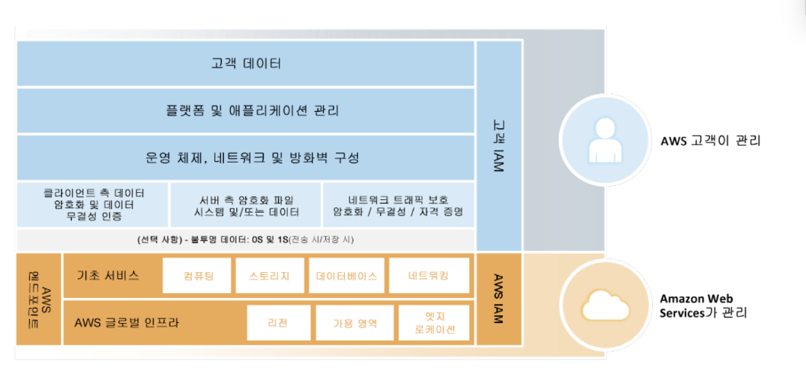
- AWS 보안 글로벌 인프라를 바탕으로 자체 데이터 센터에서 온프레미스로 하는 것과 같은 방식으로 AWS클라우드에서 운영체제와 플랫폼을 설치 및 구성
- 불투명 계층에서 데이터 암호화, 인증 등 추가로 보안을 요구할 수 있다.
-  AMI에서 EC2접속 키를 발급받으면 사용자는 이를 안전하게 보관해야 하며,  AWS 내에서는 Private key가 저장되지 않는다.

# 컨테이너 서비스의 책임 분담 모델
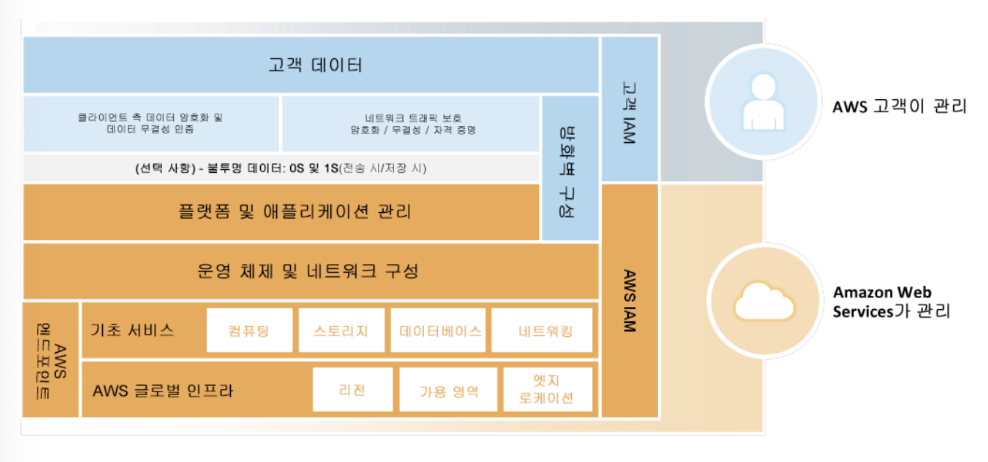
- AWS 가 플랫폼 및 애플리케이션 관리까지 함.
- AWS 컨테이너 서비스의 경우 컨테이너 서비스 액세스를 위한 데이터와 방화벽 규칙에 대한 책임은 고객에게 있다.

# AWS에서 자산정의 및 분류
- 자산, 카테고리, 비용을 결정한 후, AWS에서 정보 보안 관리 시스템(ISMS)를 구현, 운영, 모니터링, 검토, 유지 보수, 개선하기 위한 표준을 설정
- 비즈니스 요건과 목표, 사용하는 프로세스, 조직의 크기와 구조에 따라 달라짐

# AWS에서 계정, IAM 사용자, 그룹 역할 관리
- Root 계정은 매우 강력한 권한이 있기 때문에 일반 업무시 사용하지 않는 것을 권장.
- IAM 사용자로 개별적인 사용자와 보안 그룹은 분리해 각 개인 그룹별 사용자로 구분하여 권한 제한을 하는 것이 좋음

# AWS 인프라 보안
- 물리적 환경적 보안 : AWS직원의 데이터 센터에 대한 물리적 접근은 모두 기록되며 정기적으로 감사를 받으며, 여러 안전 대책에 의해 데이터 센터가 안전하게 보호됨.
- 연속성 관리 : 모든 데이터 센터는 온라인으로 고객에게 서비스를 제공하며, 어떤 데이터 센터도 정지 되지 않음. 또한 전 세계에 데이터 센터가 분산되어 있어 높은 가용성을 가진다.
- 보안 네트웤 아키텍처 : AWS는 DDOS, MITM, IP Spoofing, 포토 스캐닝, 패킷 스니핑 등의 공격 방어를 위해 강력한 보안 결함 차단 방식을 지원.

# AWS 계정 보안 기능
- AWS IAM : AWS 계정 내에서 여러 사용자를 생성하고, 이러한 사용자 각각의 권한을 관리, 임시 보안 자격 증명을 사용하여 제한된 시간 동안만 유효한 보안 자격 증명을 통해 보안 AWS리소스에 대한 임시 액세스를 사용자에게 제공
- AWS MFA : 표준 사용자 이름과 암호 자격 증명 외에 6자리 일회용 코드를 입력해야 고객의 AWS계정 설정 또는 AWS 서비스 및 리소스 액세스 권한이 부여됨, 하드웨어 토큰 및 가상 MFA 디바이스의 사용을 모두 지원

# AWS 서비스별 보안
- AWS EC2 의 보안
    - 하이퍼바이저를 이용하며, 리눅스 게스트의 경우는 반가상화를 활용, 고급 권한에 대한 통제를 한다.
    - 하이퍼바이저를 통해 인스턴스는 물리적으로 상호 격리되어 보안성을 올린다. 
    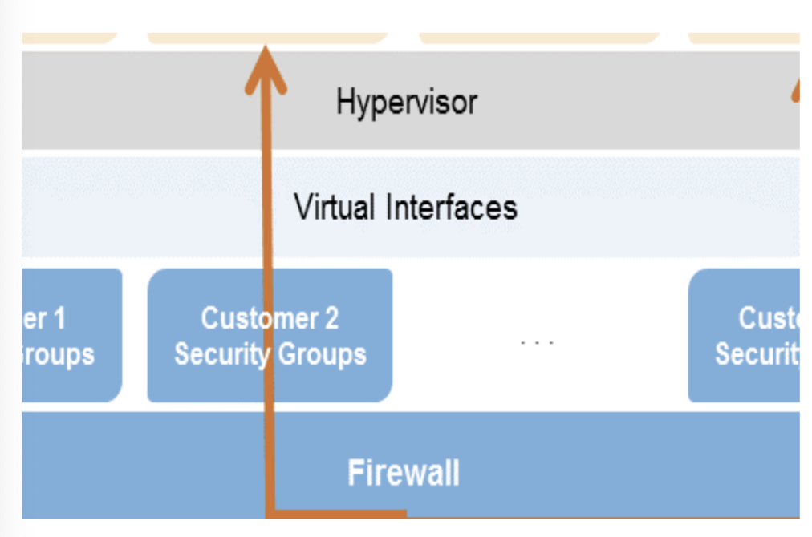
    - 가상 인스턴스는 오직 고객만 제어 할 수 있으며 전체 루트 액세스 또는 관리 제어 권한을 가진다. AWS는 고객의 인스턴스 또는 게스트 OS에 대한 어떤 액세스 권한도 접근할 수 없다.
    - 방화벽 : EC2의 인바운드 방화벽은 기본적으로 모두 거부 모드로 구성되며, 사용자가 인바운드 트래픽을 허용하는 데 필요한 포트를 임의로 개방해야함.
    - 예시: 웹 서버 그룹에는 인터넷에 개방된 포트 80(HTTP) 및/또는 포트 443(HTTPS)을 개방
    - 애플리케이션 서버 그룹에는 웹서버 그룹에만 액세스 할 수 있는 8000번 포트로 구성
    - 데이터베이스 서버 그룹에는 애플리케이션 서버 그룹에만 개방된 3006번 포트로 구성
    - 세그룹 모두 22에 대한 관리 액세스는 허용하나, 고객의 기업 네트워크에서만 가능하게 특정 IP 대역만 잡속하도록 함.

- AWS EBS 보안
    - AWS EBS 볼륨에 대한 접근은 해당 볼륨을 생성한 AWS계정 및 IAM을 이용해 만든 AWS 계정 사용자로 제한되므로, 다른 모든 AWS계정 및 사용자에게는 볼륨을 보거나 접근하는 권한이 거부된다.
    - AWS EBS에 저장된 데이터는 정상적인 서비스를 위해 물리적으로 여러 지점에 중복 보관된다.

- AWS Elastic Load Balancing 보안
    - Elastic Load Balancing은 온프레미스 로드 벨런서의 모든 장점 이외에 여러 가지 보안상 이점을 제공한다.
    - EC2 인스턴스를 대신해 암호화 및 복호화 작업을 수행 및 로드 밸런서에서 중앙집중식으로 관리 가능
    - 클라이언트에 단일 접점을 제공하며 네트워크 공격에 대한 1차 방어선 역할도 수행
    - AWS VPC를 사용하는 경우, ELB에 연결된 보안 그룹의 생성 및 관리를 지원하여 추가적인 네트워킹 및 보안 옵션을 제공
    - 보안(HTTPS/SSL) 연결을 사용하는 네트워크에서 종단 간 트래픽 암호화를 지원

- AWS VPC 보안
    - AWS VPC를 사용하면 AWS 클라우드의 격리된 부분을 만들고, 선택한 범위에 프라이빗 주소가 있는 AWS　EC2 인스턴스를 시작 할 수 있다.
    - 각 AWS VPC에서의 네트워크 트래픽은 다른 모든 AWS VPC와 격리됨.
    - AWS　VPC는 인스턴스의 진출입 트래픽을 모두필터링 할 수 있는 완전한 방화벽 솔루션을 지원
    - 네트워크 ACL: AWS VPC내 서브넷에서 인바운드 또는 아웃바운드하는 모든 트래픽에 적용되는 상태 비저장 트래픽 필터, 이러한 ACL은 IP 프로토콜, 서비스 포트, 원본/대상 IP 주소에 따라 트래픽을 허용 또는 거부하는 규칙을 포함함

- AWS S3 보안
    - 기본적으로 저장된 데이터에 대한 액게스는 제한됨, 버킷 및 객체 소유자에게만 자신이 생성한 AWS S3 리소스에 접근할 수 있다.
    - 객체 접근에 대한 액세스 제어는 IAM, ACL, 버킷정책으로 할 수 있으며, 특정 조건을 기준으로 특정 리소스에 대한 액세스를 추가로 제한 할 수 있다.
    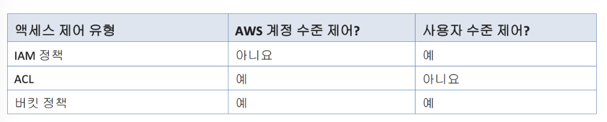
    - 데이터 저장시 S3 암호화 클라이언트와 같은 클라이언트 암호화 라이브러리를 사용하여 데이터를 암호화 한 후에 업로드 할 수 있으며, 장기 저장시 S3버킷의 콘텐츠를 Glacier에 자동으로 보관 할 수 있다.
    - Amazon S3는 연간 99.999999999%의 객체 내구성과 99.99%의 가용성을 제공하도록 설계되었으며, 버전 관리 및 액세스 로그 열람으로 추가적인 보안을 제공한다.

- AWS Glacier 보안
    - AWS Glacier는 파일을 아카이브 단위로 볼트 내에 저장.
    - 특정한 간격으로 Glacier에 데이터를 전송하도록 S3를 설정 할 수 있으며, 더 높은 수준의 보안을 달성하기 위해 SSL암호화 엔드포인트를 통해 AWS Glacier에 안전하게 데이터를 업로드 하거나 다운로드 할 수 있다.

- AWS RDS 보안
    - AWS RDS내에서 처음 DB인스턴스를 생성할 경우 DB 인스턴스에 대한 액세스를 제어하기 위해 AWS RDS안에서만 사용되는 사용자 계정을 만든다. 이후 추가로 계정 생성 가능
    - AWS VPC에 배포된 DB인스턴스는 VPN 또는 퍼블릭 서브넷에서 실행 할 수 있는 베스천 호스트를 통해 VPC 외부의 AWS EC2 인스턴스에서 액세스 할 수 있다.
    - SSL을 사용하여 애플리케이션과 DB인스턴스 사이의 연결을 암호화 하여 보안수준을 높일 수 있지만, DB 연결 지연시간을 늘리는 단점 이있다.
    - AWS RDS는 DB인스턴스 백업 및 복구를 위한 자동 백업 및 데이터베이스 스냅샷(DB스냅샷)을 제공한다.

- Amazon CloudFront 보안
    - Amazon CloudFront는 대상 API에 대한 모든 요청에 대해 인증을 요구하며 허가 받은 사용자만 Amazon CloudFront에서 배포하는 정보를 생성, 변경, 또는 삭제할 수 있도록 한다.
    - Amazon CloudFront 로부터 콘텐츠를 다운로드 할 수 있는 사람들을 제한하고자 할 경우, 서비스의 콘텐츠 비공개 기능을 사용하도록 설정할 수 있다.
    - Amazon CloudFront엣지에서 Amazon S3에 있는 고객 소유 객체에 액세스하는 방법을 제어하거나, 두번째　Amazon CloudFront엣지에서 인터넷의 최종 사용자에게 콘텐츠를 전달하는 방법을 제어한다.
    - 또한 웹 어플리케이션에 지리적 제한 로직을 추가함으로써 최종 사용자의 지리적 위치에 따라 콘텐츠에 대한 액세스를 차단하도록 사용자 지정 할 수 있다.
    - Amazon CloudFront는 사용자에게 전달되는 콘텐츠를 인증할 수 있도록 암호화된 연결 (HTTPS)을 통해 콘텐츠를 전달하는 기능을 제공한다. Amazon CloudFront 기본적으로 HTTP 및 HTTPS프로토콜을 통해 요청을 수락하며, 필요한 경우 모든요청에 대해 HTTPS를 요구하고 HTTP요청은 모두 허용하지 않도록 Amazon CloudFront를 설정할 수도 있다.
    - Amazon CloudFront에서 고유의 도메인 이름을 사용하려면 SSL인증서를 AWS IAM인증서 스토리지에 업로드한 후 해당 인증서를 Amazon CloudFront 배포에 연결해야 한다.

# AWS Security by Design
- Security by Design?
    - 여러 산업계, 표준 및 보안 기준 전체에서 대규모의 보안 및 규정 준수를 유지하기 위한 4단계 접근법
        - 수정 권한이 없는 사용자가 재정의할 수 없는 강제 기능 생성.
        - 안정적인 제어 작업 구축
        - 지속적인 실시간 감사 기능.
        - 거버넌스 정책을 스크립팅하는 기술

# AWS 환경에서의 보안
- AWS 클라우드에서 시스템을 배포할 때는 AWS 및 고객이 보안 책임을 공동으로 부담한다. AWS는 기반 인프라에 대한 보안을 담당하는 반면, 사용자는 AWS에 배포된 IT리소스에 대한 보안을 담당한다.
- Security by Design  접근법은 4단계로 구성되어 있다.
    - 1단계 : 요구사항 확인
    - 2단계 : 요구사항 및 구현 조건에 맞는 "골드환경" 구축.
    - 3단계 : 템플릿 사용설정.
    - 4단계 : 검증작업 수행.
- 1단계 - 요구사항 확인
    - 먼저 보안 제어 합히화 작업을 수행하며, 현재 고객 아키택처에 최적화되어 운영중인 제어를 식별하고, 기존 AWS인증내역, 승인 및 보고서로 부터도 참조할 내역을 식별하여 보안 Controls Implementation Matrix(CIM)를 생설 할   수 있다.
- 2단계 - "골드환경" 구축
    - 이단게는 사용자가 AWS가 제공하는 광범위한 보안 및 감사 서비스와 기능을 서로 연결하고, 보안, 규정 준수 및 감사 담당자에게 보안 및 규정 준수 환경을 구성하는 간단한 방법을 제공하도록 한다.
    - IAM으로 액세스 관리, VPC나 subnet을 이용한 네트워크 분할, 리로스 제약 조건 및 모니터링, 데이터 암호화를 통해 기능을 연결 할 수 있다.
    - AWS GoldBase : AWS GoldBase는 특정 보안/규정 준수 요구 사항 내에서 사전 점검되고 자동화된 참조 아키텍처를 제공한다. AWS GoldBase 사용 사례 패키지는 기준 CloudFormation 템플릿으로 구성되는데, 사용자는 이를 고객 환경 내 배포용으로 사용자 지정할 수 있다. 자세한 내용은 “AWS GoldBase 소개” 백서 참조
- 3단계 - 템플릿 사용 설정
    - “골드 환경”을 만든 후에는 AWS에서 이를 사용할 수 있도록 설정해야 하는데, 서비스 카탈로그를 설정하여 이를 수행할 수 있다.
    - 서비스 카탈로그를 설정하면 계정에 액세스하는 모든 사용자가 만들어진 CloudFormation 템플릿을 사용하여 자신의 환경을 만들어야 한다.
    - 사용자가 환경을 사용할 때마다 이러한 “골드 환경” 규칙이 모두 적용되어, 제어의 나머지 고객 계정 보안 구성을 효과적으로 조작할 수 있으므로 감사에 대비할 수 있다
- 4단계 - 검증작업 수행
    - 이 단계의 목표는 AWS 고객이 일반적으로 용인되는 공공 감사 표준을 기준으로 독립적인 감사를 지원할 수 있도록 하는 것.
    - AWS는 규정을 준수하지 않는 인스턴스가 실제로 있는지 여부를 감지하는 AWS Config를 제공하며, AWS Config는 아키텍처의 현재 시점 설정정보를 제공한다.
    - 또한 AWS는 보안된 읽기 액세스를 통해 여러 감사 증거 수집 기능과 증거 모음을 자동으로 감사하는 고유 API 스크립트를 함께 제공한다.

# AWS IAM 모범사례

# AWS 계정 루트 사용자 액세스 키 잠금
- AWS 계정 루트 사용자 액세스 키는 사용하면 안된다.
- 만약 그 계정의 루트 액세스 키카 탈취 되면 계정과 연관된 모든 정보, 신용카드정보 유출

# 개별 IAM 사용자 만들기
- 루트 자격 증명을 사용하여 액세스 하는 것은 안되며, 관리자 IAM을 생성하여 액세스해야하는 계정에 별도의 사용자 계정을 만드는 것이 권장된다.
- 또한 그룹을 사용하여 사용자 그룹에 대한 정의를 만들어 그룹권한을 설정하는 것이 관리하기 더 편하다.
- IAM정책을 개인이나 그룹에 적용 할 때는 작업 수행에 필요한 최소한의 권한을 주어 다른 서비스 접근을 못하게 한다.

# 엑세스 레밸을 이용한 IAM 권한 검토
- AWS은 작업 내용에 따라 각 서비스 작업을 다섯개의 액세스 레밸 즉, List, Read, Write, Permissions management, Tagging 중 하나로 분류한다. 이러한 액세스 레벨을 사용하여 어떤 작업을 정책에 포함할지 결정 할 수 있다.

# 권한있는 사용자에 대해 MFA 활성화
- 보안을 강화하기 위해 중요한 리소스 또는 API작업에 대해 액세스 권한이 부여된 IAM 사용자에 대해 멀티 팩터 인증을 적용
- 가상 핸드폰이나 실제 디바이스가 코드 생성하면 그번호를 입력해야 로그인 할 수 있다.

# AWS 게정의 활동 모니터링
- AWS의 로깅 기능을 사용하여 사용자가 계정에서 수행한 작업과 사용한 리소스를 확인하여 보안 수준을 올린다.
- 로그 파일에는 작업 시간 및 날짜, 작업의 소스 IP, 부족한 권한으로 인해 실패한 작업등이 나와 있다. 이러한 기록을 통해 비 정상적인 접근이 있는지 확인 가능하다.

# 보안 서비스 - Amazon VPC

# VPC 개념
- VPC는 사용자의 AWS계정 전용 가상 네트워크
- VPC는 AWS 클라우드에서 다름 가상 네트워크와 논리적으로 분리되어 있으며, Amazon EC2 인스턴스와 같은 AWS 리소스를 VPC에서 실행 할 수 있다.
- 서브넷: VPC의 IP 주소 범위, 지정된 서브넷으로 AWS리소스를 시작할 수 있다. 인터넷에 연결되어야 하는 리소스에는 퍼블릭 서브넷을, 인터넷에 연결되지 않는 리소스에는 프라이빗 서브넷을 사용한다.

# 인터넷 액세스
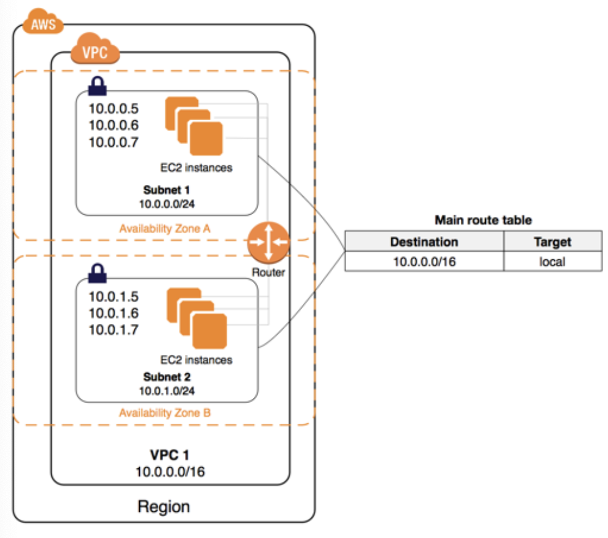
- 기본적으로 기본이 아닌 서브넷에서 시작한 인스턴스 프라이빗 Ipv4 주소가 있으며, 시작 시 특별히 지정하지 않는 한 퍼블릭 IPv4주소는 없다. 이러한 인스턴스는 서로 통신 할 수는 있지만 인터넷 액세스 할 수는 없다.

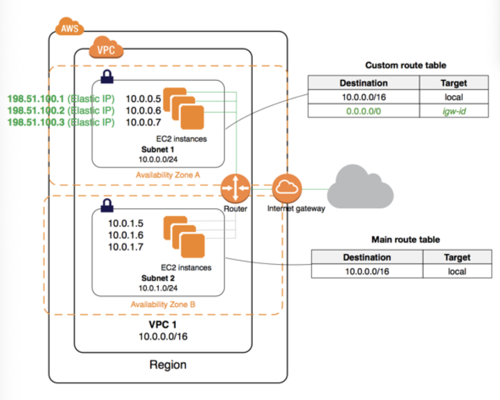
- 기본이 아닌 서브넷에서 시작한 인스턴스에 대해 해당 VPC에 인터넷 게이트웨이를 추가하고(해당 VPC가 기본 VPC가 아닐 경우)인스턴스에 탄력적 IP 주소를 연결하여 인터넷 액세스를 가능하게 할 수 있다.

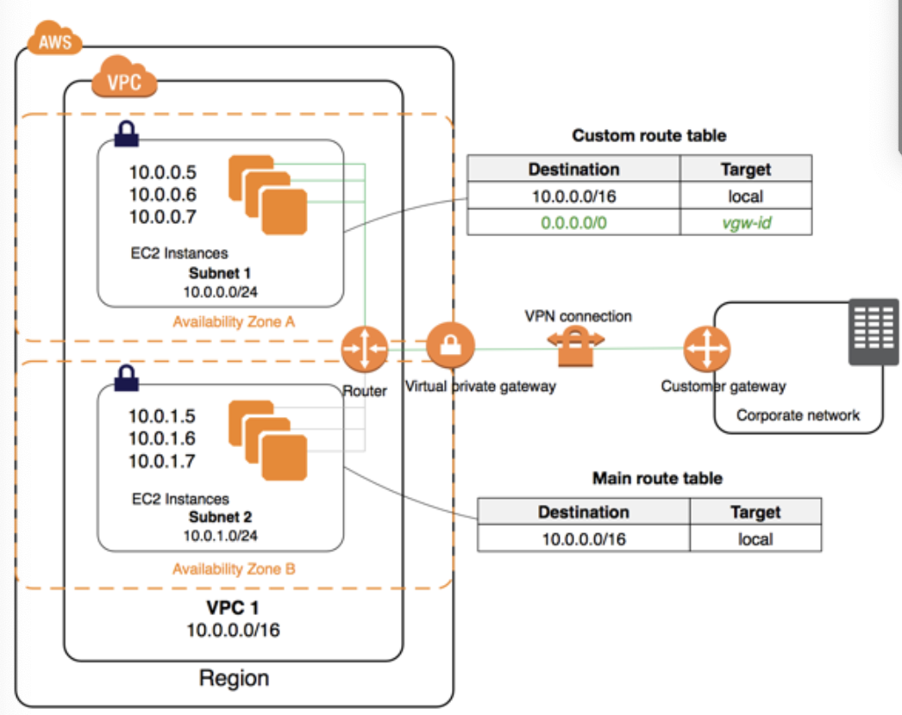
- 원할 경우 IPsec AWS Site-to-Site VPN연결을 사용하여 VPC를 회사의 데이터 선터에 연결함으로써 회사 데이터 센터를 AWS 클라우드로 확장 할 수 있다.
- Site-to-Site VPN 연결은 VPC에 추가된 가상 프라이빗 게이트웨이와 데이터 센터에 위치하는 고객 게이트 웨이로 구성된다.

# '핵심' Amazon EC2 및 S3 보안 기능 집합

# Amazon S3 리소스에 대한 액세스 권한 관리
- 기본적으로 버킷, 객체 및 관련 하위 리소스를 비롯한 모든 아마존 s3리소스는 비공개이다. 즉, 리소스를 만든 AWS 계정인 리소스 소유자만 해당 리소스에 액세스 가능하다.
- 리소스 기반 정책, 사용자 정책 또한 이러한 정책의 조합을 사용하도록 선택하여 Amazon S3 리소스에 대한 권한을 관리 할 수 있다.
- ACL : 각 버킷과 객체마다 연결된 ACL이 존재, ACL로 다른 AWS 계정에 기본적인 읽기/쓰기 권한을 부여한다.
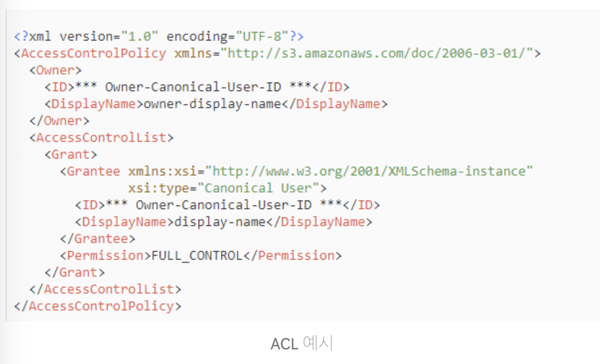
- 버킷정책 : 본인의 버킷에 한해 다른 AWS 계정이나 IAM 사용자에게 버킷과 버킷에 포함된 객체에 대한 권한을 부여하는 버킷 정책을 추가 할 수 있다.
- 버킷정책은 ACL기반 액세스 정책을 보완하여 대부분의 경우 액세스 정책을 대신한다.
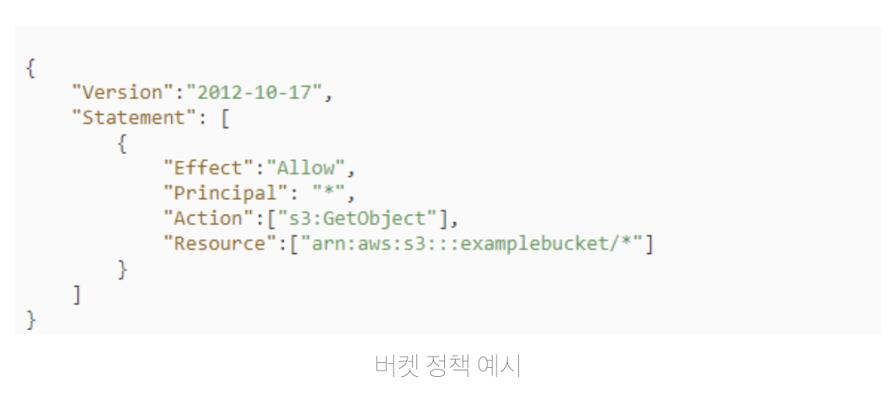
- 사용자 정책 : IAM로 Amazon S3 리로스에 대한 액세스를 관리 할 수 있다.
- 내 계정으로 IAM 사용자, 그룹, 역할을 만들고 액세스 정책을 연결하면 Amazon S3등 AWS리소스에 액세스 가능하다.

# DDos 완화

# DDos 대응을 위한 AWS 모범 사례
- DDos 공격 : 최종 사용자(End User)가 여러분의 웹 사이트나 어플리케이션을 이용할 수 없도록 만드는것, 대표적으로 네트워크나 다른 자원들을 고갈시켜 사용자의 정당한 요청을 처리할 수 없게끔 만들어 버림.

# DDos 완화 기법들
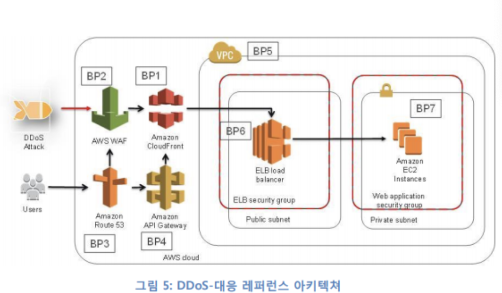
- ELB와 EC2와 같은 AWS리전 내부의 서비스들은 해당 리전 내에서 예상치 못한 트래픽의 볼륨을 다룰 수 있게끔, 확장하는 방식으로 DDos대응력을 확볼 할 수 있다.
- Amazon CloudFront, AWS WAF, Amazon Route 53, Amazon API Gateway 같은 엣지 로케이션에 제공되는 서비스를 이용하면, 글로벌 네트웍 커버리지를 이용하여 장애 대응력을 확보 할 수 있다.
- 인스턴스 사이즈 조절 : 필요한 만큼 인스턴스들을 어플리케이션 환경에 추가하는 방식으로 수평적으로 확장하거나, 좀더 큰 인스턴스로 수직 확장시키는 방법을 선택할수있다.
- 엣지에서 도메인 이름 변환하기 : Amazon Route53은 셔플 샤딩과 애니캐스트 스트라이핑 기능을 사용하여, Route53이 DDos공격을 받더라도, 사용자가 여러분의 어플리케이션에 접근 할 수 있게 해준다.
- 셔플샤딩: 위임 집합(delegation set) 내의 각 네임 서버들에 대해 엣지 로케이션들과 인터넷 경로들을 묶은 집합을 대응시켜주는 기능
- 공격 지점 줄이기: 리소스이 전혀 최종 사용자들과 직접적인 상호 작용을 하지 않는다면, 해당 리소스들이 인터넷과의 직접적인 접근을 갖지 않도록 해야함.
- AWS 리소스 감추기: 대부분의 어플리케이션에서는 AWS 리소스들이 인터넷 상에 완전히 노출될 필요가 없다. 예를 들어, ELB 뒷 단에 있는 Amazon EC2 인스턴스들은 인터넷 상에서 바로 접근할 필요가 없다.
- 이런 구성은 Amazon Virtual Private Cloud(VPC) 내부의 보안 그룹(Security Group)과 네트웍 접근제어 목록(NCAL)을 설정하면 된다.
- 보안 그룹: 인터넷으로부터 보안 그룹으로의 모든 트래픽들은 여러분들이 명시적으로 해당 트래픽을 허용해주지 않으면 기본적으로 차단된다.
- 예를 들어, 하나의 ELB 와 여러 대의 Amazon EC2 인스턴스들로 웹 어플리케이션을 구성했을 때, ELB 에 적용할 단일 보안 그룹(‘ELB 보안 그룹’)을 적용할 지, 인스턴스 별로 여러 개의 서로 다른 보안 그룹(‘웹 어플리케이션 서버 보안 그룹’)을 적용할 지는 결정해야 한다
- API 엔드 포인트를 보호하기: Amazon API Gateway 를 이용하게 되면, API 의 앞 단에 별도의 서버를 구성할 필요가 없으며, 어플리케이션 구성 요소들을 외부에서 잘 안보이도록 감출 수 있게 된다.
- Amazon API Gateway 는 Amazon CloudFront 와 연계되어 있으며, 서비스가 자체적으로 DDoS 대응력을 갖출 수 있게끔 해주는 이점을 줄 수 있다.
- 운영 기법들- 가시성: Amazon CloudWatch 를 통해, AWS 상에서 운영되고 있는 어플리케이션들을 모니터링 할 수 있다.
- VPC Flow logs: VPC Flow Logs 를 이용한다면, VPC 내의 네트웍 인터페이스들을 통해 주고받는 IP 트래픽에 대한 정보를 얻을 수 있다.

# 암호화 솔루션

# AWS에서의 저장 데이터 암호화
- 암호화에 필요한 3가지 요소
    1. 암호화할 데이터
    2. 데이터를 암호화하는 방법
    3. 데이터 및 알고리즘과 함께 사용될 키
- AWS 의 암호화 방법 3가지
- 사용자가 암호화 방법 및 전체 KMI 제어
- 사용자가 암호화 방법을 제어하고 AWS가 KMI 스토리지 구성요소를 제공, 사용자가 KMI관리 계층을 제공
- AWS가 암호화 방법 및 전체 KMI 를 제어
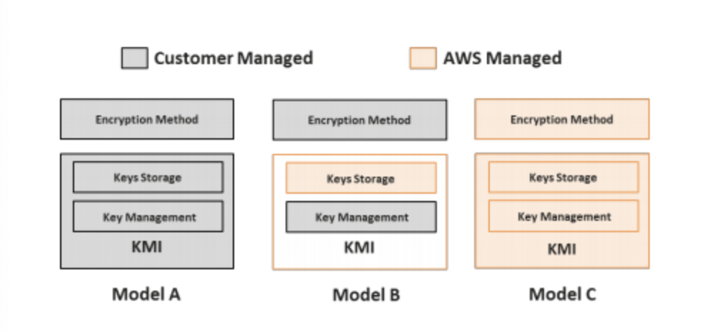

# 사용자가 암호화 방법 및 전체 KMI 제어
- Amazon S3 : 사용자가 원하는 모든 암호화 방법을 사용하여 데이터를 암호화한 다음, Amazon Simple Storage Service(S3) API를 사용하여 암호화된 데이터를 업로드
- AWS SDK에 포함되어 있는 오픈 소스 API 세트를 활용하여 암호화 가능
- Amazon EBS: 인스턴스에 블록 디바이스로 제공되므로 파일 시스템 수준 또는 블록 수준 암호화를 위해 대부분의 표준 암호화 도구를 활용할 수 있다.

# 사용자가 암호화 방법 제어, AWS가 KMI 스토리지 구성 요소 제공 및 사용자가 KMI 관리 계층 제공
- 사용자가 암호화 방법을 관리한다는 점에서 모델 A와 유사하지만, 키를 사용자가 온프레미스에서 관리하는 키 스토리지 시스템이 아닌 AWS CloudHSM 에 저장한다는 점이 모델 A와 다르다
- HSM은 키 구성 요소를 생성하고 저장하는 데 사용할 수 있으며, 암호화 및 복호화 작업을 수행하지만, 키 수명 주기 관리 기능(예: 액세스 제어 정책, 키 로테이션)을 수행하지는 않는다.

# AWS가 암호화 방법 및 전체 KMI 제어
- KMS: 관리형 암호화 서비스로, 키를 프로비저닝하고 사용하여 AWS 서비스에서 데이터 및 애플리케이션을 암호화하도록 해준다.
- AWS KMS 및 데이터를 직접 암호화하는 기타 서비스는 봉투 암호화라는 방법을 사용하여 성능과 보안 간 균형을 유지
