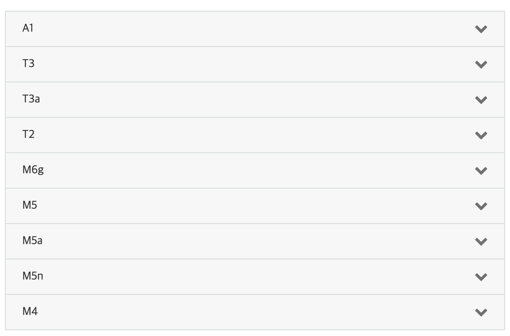
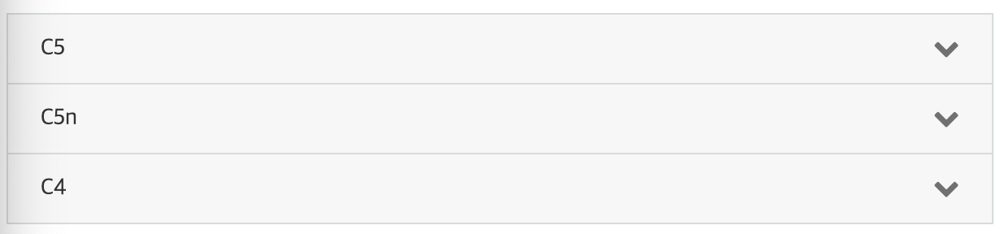
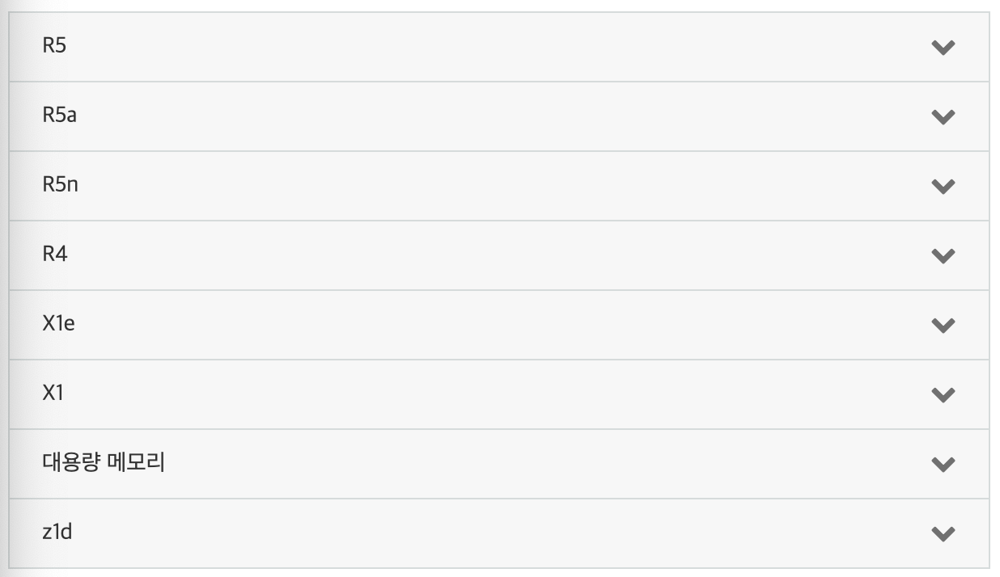
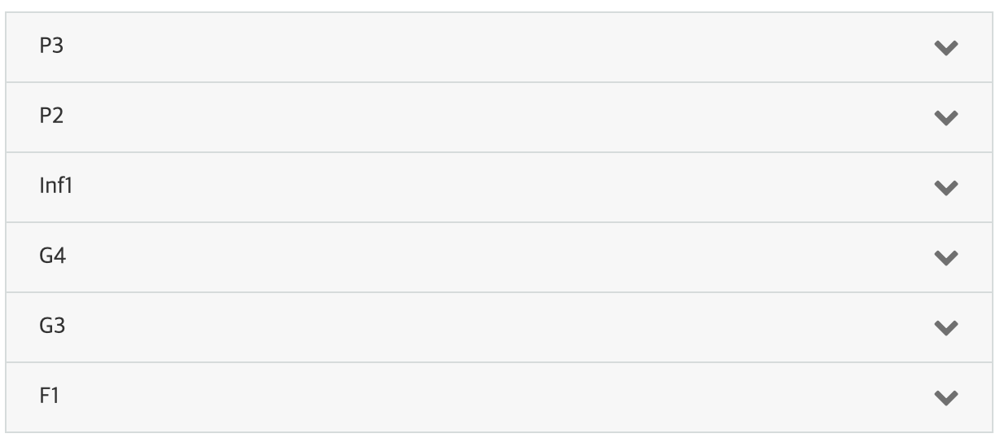

# 영역4 - 비용에 최적화된 아키텍처 설계

# 비용 최적화 단계
- 가장 낮은 비용으로 용량 요구 사항을 충족하도록 적절하게 서비스 규모 조정
- 예약시 비용 절감
- 스팟 시장 사용
- 서비스 사용 모니터링 및 추적
- Cost Explorer를 사용하여 비용 절감 최적화

# 서비스의 올바른 크기 조절 유형
- EC2는 각 사용 사례에 맞게 최적화된 다양한 인스턴스 유형을 제공
- 인스턴스 유형은 CPU, 메모리 스토리지 및 네트워킹 용량의 다양한 조합으로 구성되며, 애플리케이션에 따라 적합한 리소스 조합 선택

### 인스턴스 유형 - 범용
- 범용 인스턴스는 균형있는 컴퓨팅, 메모리 및 네트워킹 리소스 제공
- 다양한 여러 워크로드에 사용
- 웹 서버 및 코드 리포지토리와 같이 이러한 리소스를 동등한 비율로 사용하는 어플리케이션에 적합

### 인스턴스 유형 - 컴퓨팅 최적화
- 고성능 프로세서를 활용하는 컴퓨팅 집약적인 애플리케이션에 적합
- 배치 처리 워크로드, 미디어 트랜스코딩, 고성능 웹 서버, HPC(고성능 컴퓨팅), 과학적 모델링, 전용 게임 서버 및 광고 서버 엔진, 기계 학습 추론 및 기타 컴퓨팅 집약적인 애플리케이션에 매우 적합

### 인스턴스 유형 - 메모리최적화
- 메모리 최적화 인스턴스는 메모리에서 대규모 데이터 세트를 처리하는 워크로드를 위한 빠른 성능을 제공하기 위해 설계되었습니다.

### 인스턴스 유형 - 가속화된 컴퓨팅
- 가속화된 컴퓨팅 인스턴스는 하드웨어 액셀러레이터 또는 코프로세서를 사용하여 부동 소수점 수 계산이나 그래픽 처리, 데이터 패턴 일치 등의 기능을 CPU에서 실행되는 소프트웨어보다 훨씬 효율적으로 수행합니다.

# 인스턴스 유형 - 스토리지 최적화
- 로컬 스토리지에서 매우 큰 데이터 세트에 대해 많은 순차적 읽기 및 쓰기 액세스를 요구하는 워크로드를 위해 설계되었습니다. 이러한 인스턴스는 애플리케이션에 대해 지연 시간이 짧은, 수만 단위의 무작위 IOPS(초당 I/O 작업 수)를 지원하도록 최적화되었습니다.

## 스토리지 클래스
-  Amazon S3는 전체 수명 주기 동안 데이터를 관리할 수 있는 기능도 제공합니다. S3 수명 주기 정책을 설정한 후에는 애플리케이션 변경 없이 데이터가 다른 스토리지 클래스로 자동으로 전송됩니다.  

### Amazon S3 Standard(S3 Standard)
- 자주 액세스하는 데이터를 위해 높은 내구성, 가용성 및 성능을 갖춘 객체 스토리지를 제공
- 짧은 지연 시간과 많은 처리량을 제공하므로 클라우드 애플리케이션, 동적 웹 사이트, 콘텐츠 배포, 모바일 및 게임 애플리케이션, 빅 데이터 분석 등의 다양한 사용 사례에 적합
- S3 수명 주기 정책을 사용하여 애플리케이션 변경 없이 자동으로 스토리지 클래스 간에 객체를 전환할 수 있습니다.

### Amazon S3 Intelligent-Tiering(S3 Intelligent-Tiering)
- 성능 영향 또는 운영 오버헤드 없이 가장 비용 효과적인 액세스 계층으로 데이터를 자동으로 이동하여 비용을 최적화하기 위해 설계
- 두 개의 액세스 계층에 객체를 저장
    - 한 계층은 빈번한 액세스에 맞게 최적화
    - 다른 한 계층은 빈번하지 않은 액세스에 맞게 최적화
- 수명이 길고 액세스 패턴을 알 수 없거나 예측할 수 없는 데이터에 이상적

### Amazon S3 Standard-Infrequent Access(S3 Standard-IA)
- S3 Standard-IA는 자주 액세스하지 않지만 필요할 때 빠르게 액세스해야 하는 데이터에 적합
- 낮은 비용과 높은 성능의 조합을 제공하는 S3 Standard-IA는 장기 스토리지, 백업 및 재해 복구 파일용 데이터 스토어에 이상적

### Amazon S3 One Zone-Infrequent Access(S3 One Zone-IA)
- S3 Standard 또는 S3 Standard-IA 스토리지와 같은 가용성 및 복원력이 필요 없는 고객에게 적합
-  온프레미스 데이터 또는 쉽게 다시 생성할 수 있는 데이터의 보조 백업 복사본을 저장하는 경우

### Amazon S3 Glacier(S3 Glacier)
- 온프레미스 솔루션과 비슷하거나 더 저렴한 비용으로 원하는 양의 데이터를 안정적으로 저장

### Amazon S3 Glacier Deep Archive(S3 Glacier Deep Archive)
- Amazon S3에서 가장 저렴한 비용의 스토리지 클래스
- 1년에 한두 번 정도 액세스할 수 있는 데이터의 장기 보관 및 디지털 보존을 지원
-  백업 및 재해 복구 사용 사례에도 사용할 수 있으며 온프레미스 라이브러리든 오프프레미스 서비스든 상관없이 자기 테이프 시스템에 대한 비용 효과적이고 관리하기 쉬운 대안

# 예약을 통한 비용 절감
-  예약 인스턴스는 전체 선결제(AURI), 부분 선결제(PURI) 또는 선결제 없음(NURI)이라는 3가지 옵션으로 제공
- 예약 용량을 사용함으로써 조직은 위험을 최소화하고, 예산을 좀 더 예측 가능하게 관리하며, 장기 약정을 요구하는 정책을 준수

# 스팟 시장 사용
- Amazon EC2 컴퓨팅 예비 용량에 입찰
- 같은 예산으로 애플리케이션의 컴퓨팅 파워와 처리 속도를 높이며, 새로운 유형의 클라우드 컴퓨팅 애플리케이션을 실행

# Cloud Watch
- Amazon CloudWatch를 사용하여 지표를 수집 및 추적하고, 로그 파일을 모니터링하며, 경보를 설정하고, AWS 리소스 변경에 자동으로 대응할 수 있습니다. 또한 Amazon CloudWatch를 사용하여 시스템 전반의 리소스 사용률, 애플리케이션 성능, 운영 상태 파악

# Trusted Advisor
- 리소스를 프로비저닝하여 시스템 성능과 안정성을 높이고, 보안을 강화하며, 비용을 절감할 기회를 모색할 수 있습니다. 또한 늘어나거나 줄어드는 수요를 충족하기 위해 비프로덕션 인스턴스를 끄고 Amazon CloudWatch 및 Auto Scaling을 사용할 수도 있습니다.

# Cost Explorer