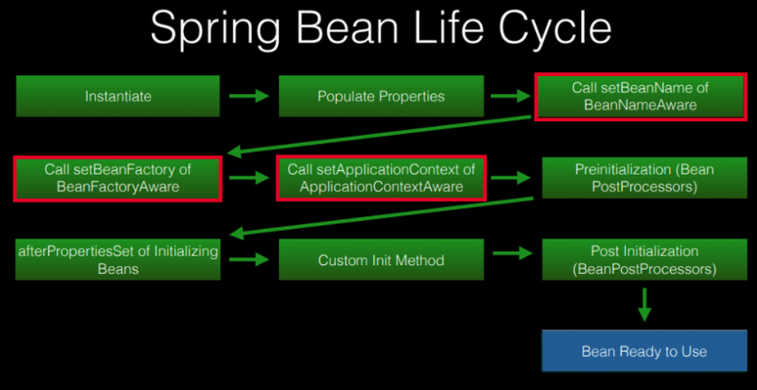
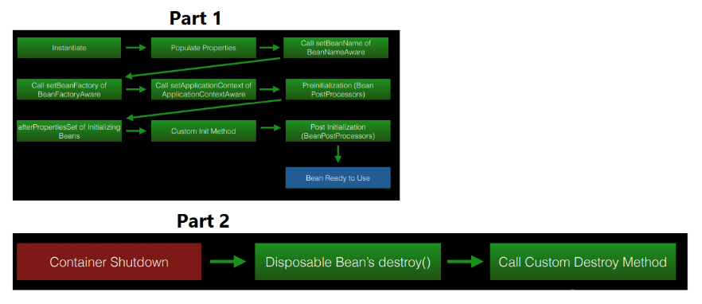

스프링에서는 빈의 생명주기 관리를 위한 방법을 몇가지를 제공하고 있다.
본 문서에서는 스프링 빈의 생명주기를 알아보고 관련 인터페이스 몇가지를 알아보자.

### Spring bean life cycle overview





* Part 1 - 빈 생성이후 사용전까지 각 단계, 전 처리 단계, 각 생성자 호출하여 생성.
* Part 2 - 빈 삭제 단계


### Aware Interfaces

많이 사용되는 인터페이스.
 * `BeanFactoryAware` : setBeanFactory() 제공
 * `BeanNameAware` : ThesetVeanName() 빈의 이름을 생성하는 인터페이스 제공
 * `ApplicationContextAware` : ThesetApplicationContext() 해당 빈의 ApplicationContext 객체 제공.

 ```java
 exmaple 1 
 ```

### Bean Post Processor
BeanPostProcessor 인터페이스는 개발자가 원하는 로직 의존성 처리로직 등을 구현 할 수 있는 콜백 메소드를 정의
 * `BeanPostProcessor`
    - postProcessBeforeInitialization: 빈의 초기화 전 수행
        > InitializingBean’s afterPropertiesSet or a custom init-method.
    - postProcessAfterInitialization: 빈 초기화 후 수행
        > Spring calls this method after any bean initialization callbacks.

### InitializingBean and DisposableBean Callback Interfaces

* `InitializingBean`
    - afterPropertiesSet 메소드 선언 , 초기화 로직 작성 가능.
* `DisposableBean`
    - destroy 메서드 선언, 빈의 삭제와 관련 코드 클린업