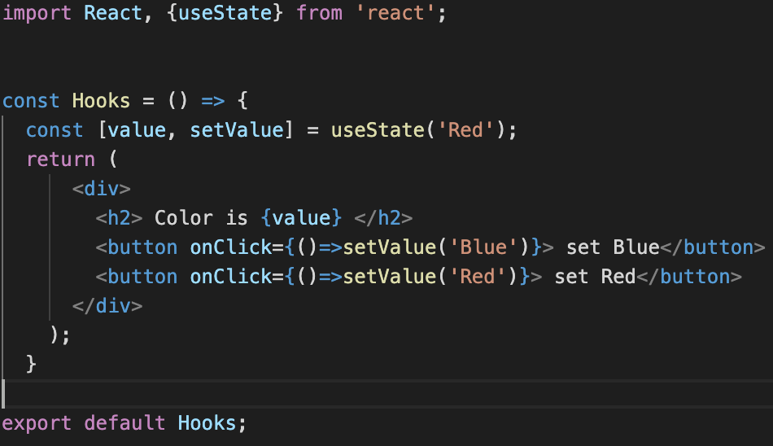
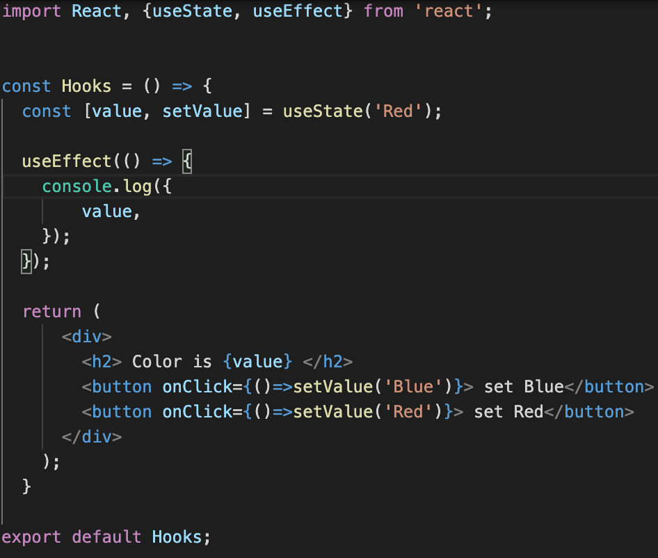

# Hooks
리액트 훅은 함수형 컴포넌트에서도 상태관리를 할 수 있는 useState, 렌더링 직후 작업을 설정하는 
useEffect 등의 기능을 제공하여 기존의 함수형 컴포넌트에서 할 수 없었던 다양한 작업을 할 수 있게 한다.


##  useState
- 함수형 컴포넌트가 가변적인 상태를 갖게 한다.



 -  useState를 Import 하여 사용한다.
 - 이러한 문법을 배열 비구조화 할당 문법이라고 하나보다.. ㅎㅎ

##  useEffect
 - 리액트 컴포넌트가 렌더링 될 떄마다 특정 작업을 수해하도록 설정할 수 있는 Hook이다.

 

 - 가장 처음 렌더링 됬을때만 실행하고 업데이트 할때는 필요없을 때

 ```
 useEffect(() => {
    console.log({
        value,
    });
  }, []);
 ```

 - 특정 값이 업데이트 됬을 때만 수행. [] 안에 검사할 값을 넣어준다.


 ```
 useEffect(() => {
    console.log({
        value,
    });
  }, [value]);
 ```

 - 컴포넌트가 언마운트 되기 직전 어떤 동작을 수행하고자 할떄
 ```
 useEffect(() => {
    console.log({
        value,
    });
    return () => {
      console.log('cleanup');
      console.log(value
      );
    };
  });
 ```


## useContext

- 함수형 컴포넌트에서 Context를 더 쉽게 사용.


## useReducer
- useState 보다 컴포넌트에서 더 다양한 상황에 따라 다양한 상태를 다른 값으로 업데이트해주고 싶을 때 사용하는 Hook 


## useMemo
- useMemo 를 사용하면 함수형 컴포넌트 내부에서 발생하는 연산을 최적화 