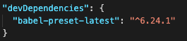
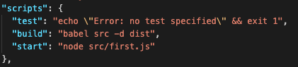

# 연습환경 만들기

 원하는 폴더에서 아래 명령어 입력

 ```>npm init```

 기본 정보들을 입력하고
 package.json 이 생성된다.

 Babel CLI 설치

  ```> npm install --save-dev babel-cli```



위와 같이 package.json 파일에서 설정이 된걸 확인 할 수 있다.




그리고 'start', 'test' 등등 npm 명령어를 등록하면 터미널에서 간단하게 코드를 실행할 수 있다.